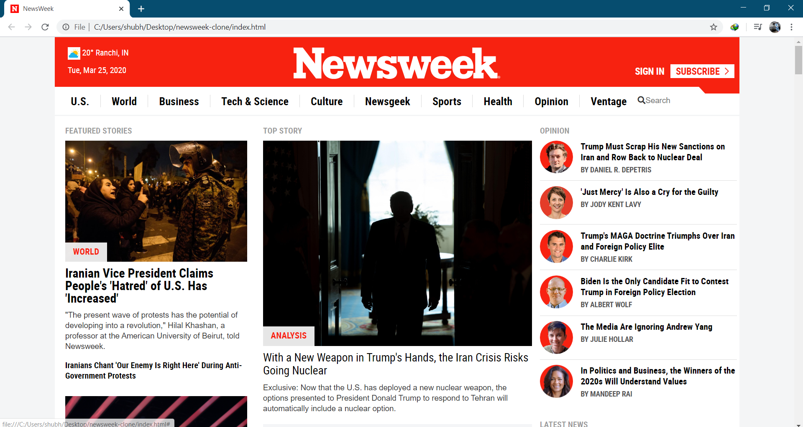

# Project: Newsweek Clone

> This project requests students to build a replica of the news site Newsweek.com using the Bootstrap framework.

[Original Page](http://newsweek.com/)

## General Page Structure
 
The overall page contains the following sections: 
- Navbar
- Key Columns: columns that organize information with articles responding to specific media sizes.
- 'In the Magazine' Section
- Newsweek Conversations
- Editor Pick
- Featured Slideshow
- <Hidden - HiDPI screen section> -- See NOTE paragraph below.
- Subscribe 
- Footer

 
## Built With

- HTML5
- CSS3
- Bootstrap
- Visual Studio Code

## Authors

👤 **Shubham Raj**

- Github: [@shubham14p3](https://github.com/shubham14p3)
- Linkedin: [shubham14p3](https://linkedin.com/shubham14p3)

## 🤝 Contributing

Contributions, issues and feature requests are welcome!

Feel free to check the [issues page](https://github.com/canriquez/newsweek-clone/issues/).

## Show your support

Give a ⭐️ if you like this project!

## Acknowledgments

- @Microverse
- My family

## 📝 License

This project is [MIT](lic.url) licensed.
